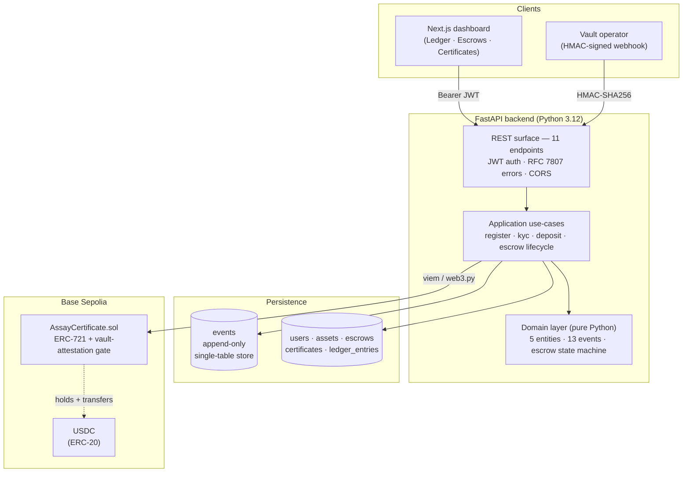

# Assay

> Reference RWA fintech architecture — physical-asset certificates of authenticity, custodian-backed escrow, on a financial-grade event-sourced ledger.

[](https://github.com/soneeee22000/assay/actions/workflows/ci.yml)
[](./LICENSE)
[](https://www.python.org/)
[](https://fastapi.tiangolo.com/)
[](https://soliditylang.org/)
[](https://nextjs.org/)
[](https://www.postgresql.org/)
[](https://tailwindcss.com/)
[](https://github.com/soneeee22000/assay/commits/main)

Assay tokenises vaulted precious metals (allocated gold and silver bullion as the worked example) as ERC-721 certificates of authenticity, settled through a custodian-backed escrow lifecycle, on an event-sourced double-entry ledger. Built end-to-end across Solidity, Python, and TypeScript — one repo, one demo, all the layers a fintech-meets-RWA platform actually needs to ship.

The wedge for engineers applying to RWA fintech roles: telecom event-pipeline experience (CDR / SMPP, Kafka) and healthcare compliance work port directly into financial event-sourcing and regulated audit trails — a combination rare on the typical Web3 application stack.

## Live Demo

| Surface                                 | URL                                                                 |
| --------------------------------------- | ------------------------------------------------------------------- |
| **Dashboard**                           | _Vercel deploy pending_                                             |
| **API + OpenAPI docs**                  | _Railway deploy pending_                                            |
| **Certificate contract** — Base Sepolia | `AssayCertificate` — deploy pending (manual-dispatch deploy Action) |

Sign in with `admin@example.com` / `adminpass1234`. The dashboard is pre-seeded with a full escrow lifecycle — Opened → Funds locked → Vault attested → Certificate minted → Released — visible across the Ledger, Escrows, and Certificates views.

## Architecture



State transitions are projected from the event stream; the on-chain certificate transfer is gated by an off-chain HMAC attestation (ADR-002), letting real-world custodians integrate without holding a crypto wallet.

## Features

**Domain & ledger**

- Pure-Python domain layer with zero framework imports; 91 unit tests at 99% line coverage
- Append-only event store (single-table per ADR-003) with deterministic replay
- Seven-state escrow lifecycle (`PENDING → FUNDS_LOCKED → VAULT_ATTESTED → CERTIFICATE_MINTED → RELEASED`)
- Double-entry ledger projection with non-negative balance invariants

**On-chain layer**

- ERC-721 certificate of authenticity on Base Sepolia, OpenZeppelin v5 base, Pausable + role-based access control
- `_update` override blocks transfers until vault attestation lands — physical custody handoff anchored on-chain
- Foundry test suite (unit + invariant), verified deploys via manual-dispatch GitHub Action

**HTTP surface**

- 11-endpoint FastAPI app (`/api/v1/...`) with idempotency-key support and RFC 7807 problem-details errors
- scrypt password hashing + python-jose JWT (stub auth per ADR-004; swap-in point for Clerk / Auth0)
- HMAC-SHA256 vault webhook with `(operator_id, nonce)` replay protection
- Signed audit-trail CSV export for regulator-style read access

**Admin dashboard**

- Next.js 16 App Router · React 19 · TypeScript strict · Tailwind 4 with oklch design tokens
- Four views: Ledger timeline, Escrow list, Escrow detail (step-by-step lifecycle), Certificates gallery
- Lucide-React iconography, Fira Sans + Fira Code typography, semantic colour tokens, full dark-mode support
- Mobile-first responsive layouts; 44px tap targets; uniform focus ring; `prefers-reduced-motion` respected

**Operations**

- GitHub Actions CI matrix across Python (ruff + mypy + pytest), Foundry (forge build/test/fmt), and Node (tsc + next build)
- Alembic migration with seven tables; Docker Compose for local Postgres
- Railway + Vercel deploy configs; Playwright demo-recording spec; idempotent seed script

## Tech Stack

| Layer           | Choice                                                                                         |
| --------------- | ---------------------------------------------------------------------------------------------- |
| Smart contracts | Solidity 0.8.28 · Foundry · OpenZeppelin ERC-721 + AccessControl + Pausable                    |
| Backend         | Python 3.12 · FastAPI · SQLAlchemy 2 (async) · Pydantic v2 · Alembic · python-jose · structlog |
| Frontend        | Next.js 16 (App Router) · React 19 · TypeScript strict · Tailwind 4 oklch tokens · Lucide      |
| Database        | Postgres 16 (event store + projections)                                                        |
| Chain           | Base Sepolia (Coinbase L2) · Alchemy / CDP RPC · Basescan verification                         |
| Storage         | IPFS via Pinata for certificate metadata                                                       |
| Tests           | pytest + testcontainers for backend · Foundry forge for contracts · Playwright for E2E         |
| CI              | GitHub Actions matrix (Python + Foundry + Node)                                                |
| Deploy          | Railway (backend + Postgres) · Vercel (frontend) · GitHub Action (contract)                    |

## Getting Started

The full local runbook is in [`GETTING-STARTED.md`](./GETTING-STARTED.md). The short version:

```bash
# 1. Start Postgres (Docker Desktop must be running)
docker compose up postgres -d

# 2. Schema + backend
cd backend
python -m venv .venv && .venv\Scripts\activate     # PowerShell on Windows
pip install -e ".[dev]"
copy .env.example .env                              # generate JWT_SECRET inside
alembic upgrade head
uvicorn assay.main:app --reload --port 8000      # → http://localhost:8000/docs

# 3. Drive an escrow lifecycle so the dashboard has data
cd ..
python scripts/demo/seed.py

# 4. Frontend
cd frontend
npm install
npm run dev                                          # → http://localhost:3000
```

Demo credentials after seed: `admin@example.com` / `adminpass1234`.

## API Reference

The full OpenAPI spec is at [`docs/openapi.yaml`](./docs/openapi.yaml). Live `/docs` available when the backend runs.

| Method | Path                              | Auth   | Purpose                                           |
| ------ | --------------------------------- | ------ | ------------------------------------------------- |
| POST   | `/api/v1/auth/login`              | —      | Issue a JWT for an email/password pair            |
| POST   | `/api/v1/users`                   | —      | Register a new user (KYC starts PENDING)          |
| POST   | `/api/v1/users/{id}/kyc`          | Admin  | Approve or reject KYC                             |
| POST   | `/api/v1/users/{id}/deposit`      | Admin  | Credit USDC into a user's available balance       |
| POST   | `/api/v1/assets`                  | Admin  | Register a physical asset to a seller             |
| POST   | `/api/v1/escrows`                 | Admin  | Open an escrow between a buyer and a seller       |
| POST   | `/api/v1/escrows/{id}/lock-funds` | Admin  | Move buyer's USDC into the escrow's locked bucket |
| POST   | `/api/v1/vault/attest`            | HMAC   | Vault operator's custody-handoff confirmation     |
| POST   | `/api/v1/escrows/{id}/mint`       | Admin  | Mint the ERC-721 certificate (calls chain client) |
| POST   | `/api/v1/escrows/{id}/release`    | Admin  | Credit seller, transfer certificate ownership     |
| GET    | `/api/v1/escrows/{id}`            | Bearer | Read escrow projection with full lifecycle stamps |
| GET    | `/api/v1/audit/export`            | Admin  | Signed CSV export of all events in a time window  |

## Project Structure

```
assay/
├── backend/                            FastAPI · SQLAlchemy 2 async · Postgres
│   ├── src/assay/
│   │   ├── domain/                     Pure-Python entities, events, value objects
│   │   ├── application/                Use-cases (register · kyc · escrow lifecycle)
│   │   └── adapters/
│   │       ├── api/                    FastAPI router + RFC 7807 errors + JWT deps
│   │       ├── auth/                   scrypt + python-jose JWT provider
│   │       ├── chain/                  Stub chain client (real Base client = Sprint 6)
│   │       ├── persistence/            SQLAlchemy models · event store · repositories · Alembic
│   │       └── webhook/                HMAC verifier + nonce cache
│   └── tests/                          Domain unit + adapters integration (testcontainers)
├── contracts/                          Foundry workspace
│   ├── src/AssayCertificate.sol     ERC-721 with vault-attestation gate
│   ├── script/Deploy.s.sol             forge script Deploy --broadcast --verify
│   └── test/                           Unit + invariant tests
├── frontend/                           Next.js 16 App Router · Tailwind 4
│   └── src/
│       ├── app/                        login · ledger · escrows/[id] · certificates
│       ├── components/                 ui.tsx (primitives) · dashboard-shell · auth-gate
│       ├── e2e/record.spec.ts          Playwright dashboard walk-through (demo GIF)
│       └── lib/                        api client · cn helper · useAuth hook
├── docs/
│   ├── PRD-ASSAY.md                 Product spec + sprint plan
│   ├── ARCHITECTURE.md                 System context · hexagonal · state machine · schema
│   ├── adr/decisions.md                Four locked ADRs
│   ├── openapi.yaml                    Full API surface
│   └── DEPLOY.md                       Railway + Vercel + Foundry deploy recipe
├── scripts/demo/
│   └── seed.py                         Drives a full escrow lifecycle for demos
├── .github/workflows/
│   ├── ci.yml                          Backend + Contracts + Frontend matrix
│   └── deploy-contract.yml             Manual-dispatch Foundry deploy with secrets
├── docker-compose.yml                  Local Postgres on :5433
└── GETTING-STARTED.md                  Step-by-step local runbook
```

## Deploy

End-to-end recipe in [`docs/DEPLOY.md`](./docs/DEPLOY.md):

1. **Smart contract** — `gh workflow run deploy-contract.yml` (manual dispatch with secrets)
2. **Backend + Postgres** — Railway via the supplied `railway.toml` + Dockerfile
3. **Frontend** — Vercel via `vercel --prod`
4. **Demo data** — `python scripts/demo/seed.py` against the live backend
5. **Demo GIF** — Playwright recording via `frontend/e2e/record.spec.ts`

Cost estimate for a 24/7 demo deploy: **~$5/month** (Railway Hobby covers backend + Postgres; Vercel free tier; Base Sepolia is free).

## Decision Artefacts

- [`docs/PRD-ASSAY.md`](./docs/PRD-ASSAY.md) — Product spec + sprint plan + risks
- [`docs/ARCHITECTURE.md`](./docs/ARCHITECTURE.md) — System context · hexagonal · state machine · schema
- [`docs/adr/decisions.md`](./docs/adr/decisions.md) — ADR-001 ERC-721 · ADR-002 vault attestation · ADR-003 single events table · ADR-004 stub JWT
- [`docs/openapi.yaml`](./docs/openapi.yaml) — Full API surface
- [`docs/DEPLOY.md`](./docs/DEPLOY.md) — Deploy guide
- [`docs/PIVOT-NOTE.md`](./docs/PIVOT-NOTE.md) — Earlier direction retired in favour of RWA fintech; archives in [`docs/archive/`](./docs/archive)
- [`CHANGELOG.md`](./CHANGELOG.md) — Release history

## Author

**Pyae Sone Kyaw (Seon)** — Founder & AI Engineer at Ekkhara (Paris, Station F).
GitHub [@soneeee22000](https://github.com/soneeee22000) · Portfolio [pseonkyaw.dev](https://pseonkyaw.dev)

## License

MIT — see [`LICENSE`](./LICENSE).
