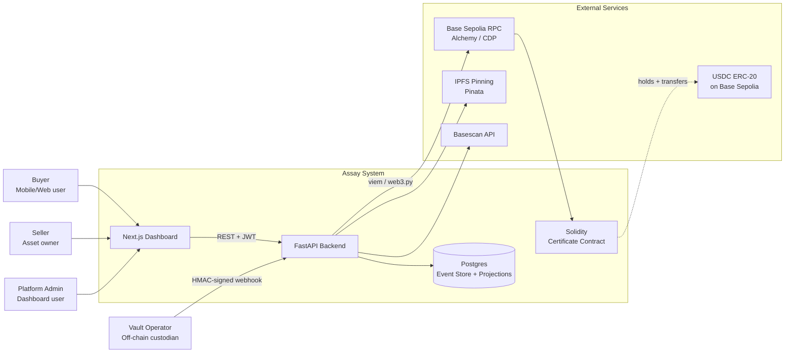
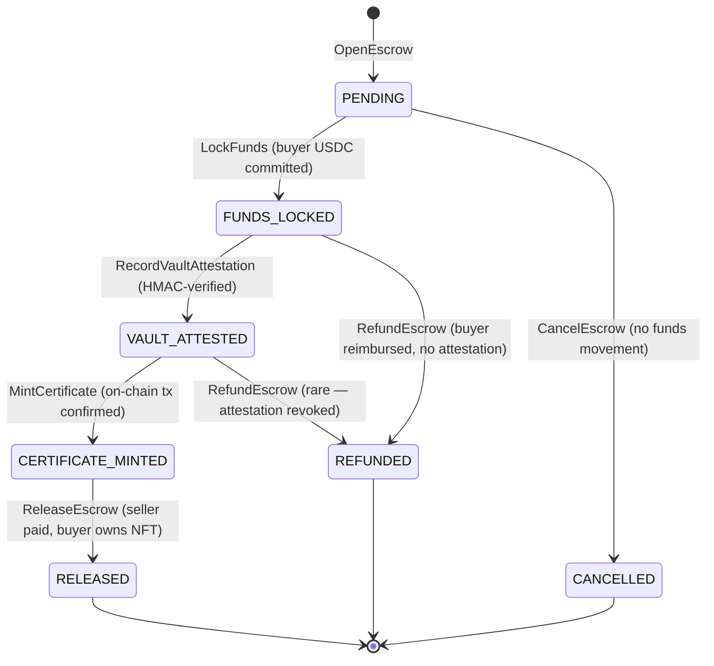

# Assay — Architecture

**Reference architecture for an RWA fintech: physical-asset certificate-of-authenticity NFTs settled through a custodian-backed escrow on a financial-grade event-sourced ledger.**

This document is the architectural plan. Decisions on contested choices are captured in [`adr/decisions.md`](./adr/decisions.md); the API surface is in [`openapi.yaml`](./openapi.yaml); the product spec is in [`PRD-ASSAY.md`](./PRD-ASSAY.md).

---

## 1. System Context



The platform is the single source of truth for funds and escrow state. Certificates live on-chain; the ledger lives in Postgres. Vault operators integrate via a one-way HMAC webhook — they never need a crypto wallet of their own.

---

## 2. Hexagonal Architecture (backend)

```mermaid
flowchart TB
    subgraph DriverAdapters[Driver Adapters &#40;in&#41;]
        REST[FastAPI REST]
        Webhook[Vault Webhook]
        AdminAPI[Admin Endpoints]
    end

    subgraph Application[Application Layer]
        UC1[RegisterUser]
        UC2[OpenEscrow]
        UC3[LockFunds]
        UC4[RecordVaultAttestation]
        UC5[MintCertificate]
        UC6[ReleaseEscrow]
        UC7[CancelEscrow]
        UC8[ExportAuditTrail]
    end

    subgraph Domain[Domain Layer]
        Entities[Entities<br/>User · Asset · Escrow · Certificate]
        Events[Domain Events<br/>EscrowOpened · FundsLocked · VaultAttested · CertificateMinted · EscrowReleased]
        VOs[Value Objects<br/>Money · TokenId · IpfsHash · HmacNonce]
    end

    subgraph DrivenAdapters[Driven Adapters &#40;out&#41;]
        EventStore[Postgres Event Store]
        Projections[Postgres Read Models]
        Chain[Base RPC Client]
        IPFSAdapter[IPFS Pinner]
        HmacVerifier[HMAC Verifier &#43; Nonce Cache]
    end

    DriverAdapters --> Application
    Application --> Domain
    Application --> DrivenAdapters

    style Domain fill:#1e293b,color:#fff
    style Application fill:#334155,color:#fff
```



**Strict rule:** Domain layer imports nothing from FastAPI, SQLAlchemy, viem, web3.py, or any framework. Tested in milliseconds without a DB.

---

## 3. Domain Model

### Entities

| Entity               | Identity                | Key state                                                                                         |
| -------------------- | ----------------------- | ------------------------------------------------------------------------------------------------- |
| **User**             | `user_id` (UUID)        | email, kyc_status, wallet_address (optional), available_balance, locked_balance                   |
| **Asset**            | `asset_id` (UUID)       | asset_type, grade, weight, lab_cert_number, photo_ipfs_hash, vault_location, owner_user_id        |
| **Escrow**           | `escrow_id` (UUID)      | buyer_id, seller_id, asset_id, amount_usdc, state, opened_at, locked_at, attested_at, released_at |
| **Certificate**      | `certificate_id` (UUID) | asset_id, owner_user_id, token_id (on-chain), tx_hash, ipfs_metadata_hash, minted_at              |
| **VaultAttestation** | `attestation_id` (UUID) | escrow_id, vault_operator_id, payload_hash, nonce, signature, received_at                         |

### State machine — Escrow



State transitions are enforced by the domain layer; the read-model projection is derived from the event stream. There is no path that mutates an escrow without an event being persisted first.

### Domain events

```
UserRegistered { user_id, email, ts }
KycApproved { user_id, ts }
KycRejected { user_id, reason, ts }
FundsDeposited { user_id, amount_usdc, tx_hash, ts }
EscrowOpened { escrow_id, buyer_id, seller_id, asset_id, amount_usdc, ts }
FundsLocked { escrow_id, ts }
VaultAttested { escrow_id, attestation_id, payload_hash, ts }
CertificateMinted { escrow_id, certificate_id, token_id, tx_hash, ipfs_hash, ts }
EscrowReleased { escrow_id, ts }
EscrowCancelled { escrow_id, reason, ts }
EscrowRefunded { escrow_id, amount_usdc, tx_hash, ts }
FundsWithdrawn { user_id, amount_usdc, tx_hash, ts }
```

Every event carries: `event_id`, `stream_id` (the aggregate it belongs to), `version` (sequential within stream), `correlation_id` (for tracing a use-case across multiple events), `ts`.

---

## 4. Database Schema (PostgreSQL)

```sql
-- Single events table (see ADR-003)
CREATE TABLE events (
    event_id       UUID        PRIMARY KEY,
    stream_id      UUID        NOT NULL,
    stream_type    TEXT        NOT NULL,             -- 'user' | 'asset' | 'escrow' | 'certificate'
    version        INTEGER     NOT NULL,             -- sequential per stream
    event_type     TEXT        NOT NULL,
    payload        JSONB       NOT NULL,
    correlation_id UUID        NOT NULL,
    ts             TIMESTAMPTZ NOT NULL DEFAULT NOW(),
    UNIQUE (stream_id, version)
);
CREATE INDEX idx_events_stream      ON events (stream_id, version);
CREATE INDEX idx_events_correlation ON events (correlation_id);
CREATE INDEX idx_events_ts          ON events (ts);

-- Read-model projections (rebuilt from events)
CREATE TABLE users (
    user_id           UUID        PRIMARY KEY,
    email             TEXT        UNIQUE NOT NULL,
    kyc_status        TEXT        NOT NULL DEFAULT 'PENDING',  -- PENDING | APPROVED | REJECTED
    wallet_address    TEXT,
    available_balance NUMERIC(20, 6) NOT NULL DEFAULT 0,
    locked_balance    NUMERIC(20, 6) NOT NULL DEFAULT 0,
    created_at        TIMESTAMPTZ NOT NULL,
    updated_at        TIMESTAMPTZ NOT NULL
);

CREATE TABLE assets (
    asset_id          UUID        PRIMARY KEY,
    asset_type        TEXT        NOT NULL,
    grade             TEXT,
    weight_troy_oz     NUMERIC(10, 3),
    lab_cert_number   TEXT        UNIQUE NOT NULL,
    photo_ipfs_hash   TEXT,
    vault_location    TEXT        NOT NULL,
    owner_user_id     UUID        NOT NULL REFERENCES users(user_id),
    created_at        TIMESTAMPTZ NOT NULL,
    updated_at        TIMESTAMPTZ NOT NULL
);

CREATE TABLE escrows (
    escrow_id         UUID        PRIMARY KEY,
    buyer_id          UUID        NOT NULL REFERENCES users(user_id),
    seller_id         UUID        NOT NULL REFERENCES users(user_id),
    asset_id          UUID        NOT NULL REFERENCES assets(asset_id),
    amount_usdc       NUMERIC(20, 6) NOT NULL,
    state             TEXT        NOT NULL,         -- PENDING | FUNDS_LOCKED | VAULT_ATTESTED | CERTIFICATE_MINTED | RELEASED | CANCELLED | REFUNDED
    opened_at         TIMESTAMPTZ NOT NULL,
    locked_at         TIMESTAMPTZ,
    attested_at       TIMESTAMPTZ,
    minted_at         TIMESTAMPTZ,
    released_at       TIMESTAMPTZ,
    cancelled_at      TIMESTAMPTZ,
    refunded_at       TIMESTAMPTZ,
    CONSTRAINT escrow_state_check CHECK (state IN ('PENDING', 'FUNDS_LOCKED', 'VAULT_ATTESTED', 'CERTIFICATE_MINTED', 'RELEASED', 'CANCELLED', 'REFUNDED'))
);
CREATE INDEX idx_escrows_buyer  ON escrows (buyer_id);
CREATE INDEX idx_escrows_seller ON escrows (seller_id);
CREATE INDEX idx_escrows_state  ON escrows (state);

CREATE TABLE certificates (
    certificate_id      UUID        PRIMARY KEY,
    asset_id            UUID        NOT NULL UNIQUE REFERENCES assets(asset_id),
    owner_user_id       UUID        NOT NULL REFERENCES users(user_id),
    token_id            NUMERIC(78, 0) NOT NULL,                       -- uint256 mirror
    contract_address    TEXT        NOT NULL,
    tx_hash             TEXT        NOT NULL,
    ipfs_metadata_hash  TEXT        NOT NULL,
    minted_at           TIMESTAMPTZ NOT NULL
);
CREATE UNIQUE INDEX idx_cert_token ON certificates (contract_address, token_id);

CREATE TABLE vault_attestations (
    attestation_id    UUID        PRIMARY KEY,
    escrow_id         UUID        NOT NULL REFERENCES escrows(escrow_id),
    vault_operator_id TEXT        NOT NULL,
    payload_hash      TEXT        NOT NULL,
    nonce             TEXT        NOT NULL,
    signature         TEXT        NOT NULL,
    received_at       TIMESTAMPTZ NOT NULL,
    UNIQUE (vault_operator_id, nonce)              -- replay protection
);

-- Double-entry ledger view (materialised)
CREATE TABLE ledger_entries (
    entry_id      UUID        PRIMARY KEY,
    event_id      UUID        NOT NULL REFERENCES events(event_id),
    account_id    TEXT        NOT NULL,             -- 'user:<uuid>:available' | 'user:<uuid>:locked' | 'platform:fees' | 'escrow:<uuid>'
    direction     CHAR(1)     NOT NULL CHECK (direction IN ('D', 'C')),
    amount_usdc   NUMERIC(20, 6) NOT NULL CHECK (amount_usdc > 0),
    ts            TIMESTAMPTZ NOT NULL
);
CREATE INDEX idx_ledger_account ON ledger_entries (account_id, ts);
CREATE INDEX idx_ledger_event   ON ledger_entries (event_id);
```

All `NUMERIC(20, 6)` for USDC amounts (6 decimals matches USDC's on-chain precision). All timestamps `TIMESTAMPTZ` in UTC.

---

## 5. Smart Contract Layer

```
contracts/
├── src/
│   ├── AssayCertificate.sol      ERC-721 cert with vault-attestation transfer gate
│   └── interfaces/
│       └── IAssayCertificate.sol
├── script/
│   └── Deploy.s.sol                  Foundry deploy script for Base Sepolia
└── test/
    ├── AssayCertificate.t.sol     Unit tests (Foundry forge-std)
    └── invariants/
        └── CertInvariants.t.sol      Invariant tests (no double-mint, attestation required)
```

### `AssayCertificate.sol` surface

```solidity
contract AssayCertificate is ERC721, Pausable, AccessControl {
    bytes32 public constant MINTER_ROLE   = keccak256("MINTER_ROLE");
    bytes32 public constant ATTESTER_ROLE = keccak256("ATTESTER_ROLE");

    struct Attestation { bool attested; string vaultRef; uint256 ts; }
    mapping(uint256 => Attestation) public attestations;
    mapping(uint256 => string)      public ipfsMetadataHash;

    function mint(address to, uint256 tokenId, string calldata ipfsHash) external onlyRole(MINTER_ROLE) whenNotPaused;
    function attestVault(uint256 tokenId, string calldata vaultRef) external onlyRole(ATTESTER_ROLE);
    function _beforeTokenTransfer(...) internal override whenNotPaused {
        require(attestations[tokenId].attested, "Assay: vault attestation required");
        super._beforeTokenTransfer(...);
    }
}
```

The platform's backend holds both `MINTER_ROLE` and `ATTESTER_ROLE` on Base Sepolia. In production they would be split across separate operational accounts (or guarded by a multisig). For the portfolio demo, single admin EOA is acceptable and explicitly noted in the README.

---

## 6. External Integrations

| Integration            | Purpose                                       | Auth                      | Failure mode                                                      |
| ---------------------- | --------------------------------------------- | ------------------------- | ----------------------------------------------------------------- |
| **Alchemy / CDP RPC**  | Submit txs, read logs, fetch receipts         | API key                   | Retry w/ exponential backoff; fall back to Coinbase CDP RPC       |
| **Basescan API**       | Verify deployed contract, link from dashboard | API key                   | Non-blocking — log + skip                                         |
| **Pinata (IPFS)**      | Pin certificate metadata + asset photos       | JWT                       | Retry queue; certificate cannot mint until pin succeeds           |
| **USDC contract**      | ERC-20 balance reads (deposits, withdrawals)  | None (read) / EOA (write) | Treat as authoritative — never compute USDC balance off-chain     |
| **Vault HTTP webhook** | Vault operator posts attestations             | HMAC-SHA256 + nonce       | Reject unknown nonce; reject invalid signature; alert on >3 fails |

### Vault Webhook contract

```http
POST /api/v1/vault/attest
X-Assay-Operator-Id: vault-zurich-001
X-Assay-Nonce: 8f2a-...-d3c1
X-Assay-Signature: <HMAC-SHA256 of body, base64>

{
  "escrow_id": "uuid",
  "vault_ref": "ZUR-2026-05-11-A47C",
  "attested_at": "2026-05-11T14:23:00Z",
  "attestation_result": "CONFIRMED"
}
```

Replay protection: `(operator_id, nonce)` must be unique. Signature verification uses the operator's pre-shared secret stored in `vault_operators` config.

---

## 7. Deployment

| Component    | Host         | Notes                                                                              |
| ------------ | ------------ | ---------------------------------------------------------------------------------- |
| Backend      | Railway      | Docker container, single instance. Health check endpoint. Auto-deploy from `main`. |
| Postgres     | Railway      | Managed add-on. Point-in-time recovery enabled. Daily backups.                     |
| Frontend     | Vercel       | Edge runtime. Auto-deploy from `main`.                                             |
| Contracts    | Base Sepolia | Deployed via Foundry script. Verified on Basescan with full source.                |
| IPFS gateway | Pinata       | Free tier. Public gateway URL pinned in metadata.                                  |
| Secrets      | Railway env  | `.env.example` committed; real `.env` gitignored.                                  |

Public URLs for the demo: `assay-backend.up.railway.app`, `assay.vercel.app`, contract on Basescan. All linked from README.

---

## 8. Cross-Cutting Concerns

- **Logging:** structlog (JSON) with `correlation_id` injected per request. All HTTP/RPC/DB calls log with the same correlation_id so a single use-case can be traced end-to-end.
- **Idempotency:** every state-changing endpoint accepts an `Idempotency-Key` header; duplicate keys return the cached response.
- **Error model:** RFC 7807 problem-details for all 4xx/5xx responses.
- **Time:** server clock authoritative; never trust client timestamps for ordering.
- **Money:** never represent USDC as a float. Always `Decimal` in Python, `NUMERIC(20, 6)` in Postgres, `uint256` on-chain.

---

## 9. Testing Strategy

| Layer           | Tool                            | Target coverage           | Notes                                                                          |
| --------------- | ------------------------------- | ------------------------- | ------------------------------------------------------------------------------ |
| Domain          | pytest, no DB                   | 100%                      | Pure logic — invariants, state transitions, event derivation                   |
| Application     | pytest + in-memory adapters     | 90%+                      | Use-cases with fake event store, fake chain client                             |
| Adapter (DB)    | pytest + real Postgres (Docker) | 80%+                      | Integration tests; mocking DB hides too many bugs (per global feedback memory) |
| Adapter (chain) | pytest + Anvil (local fork)     | 80%+                      | Foundry's anvil for fast EVM testing                                           |
| Contract        | Foundry forge                   | 95%+                      | Unit + invariant + fuzz                                                        |
| E2E             | Playwright                      | Happy path + 2 edge cases | Drives the Next.js dashboard against a Railway preview backend                 |

CI: a single GitHub Actions workflow runs all layers in parallel matrices on every push to `main` and on every PR. Total expected runtime under 5 minutes.

---

## 10. Bottlenecks and Scaling

Honestly noted for the portfolio audience:

- The `events` table grows unboundedly. Production would partition by month and archive to cold storage. For the demo, fine as-is.
- On-chain mint adds ~5-10 seconds of latency to escrow release on Base. UX hides this with optimistic state + polling.
- IPFS pinning can fail silently — wrap in a retry queue with a max-attempt circuit breaker. Demo pins on the request hot path; production would queue.
- The single backend instance is a SPOF. Production would run 2+ behind a load balancer with sticky sessions only for the WebSocket logs view (which doesn't exist in v1).

What is intentionally NOT solved: multi-chain, multi-currency FX, real KYC/AML provider, real custody integration. The integration _points_ are exposed in code; the _implementations_ are stubs. Out of scope is explicit, not accidental.
